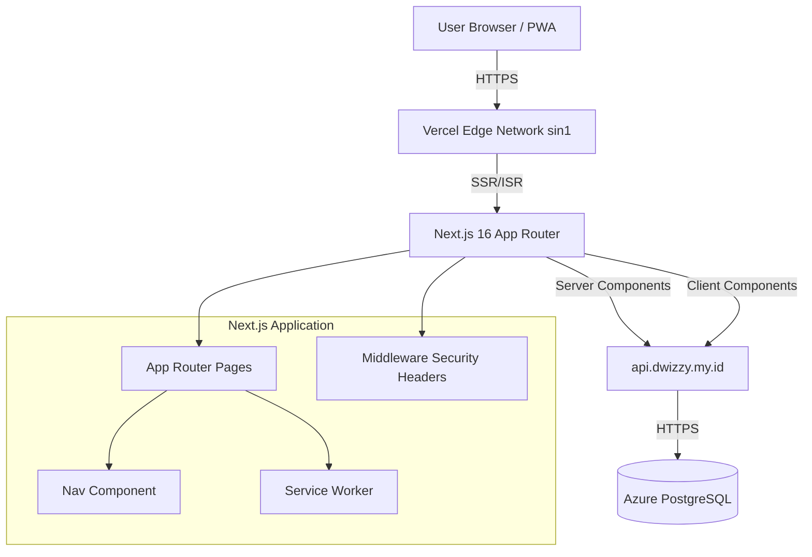

# Jawatch — End-to-End Documentation
> **Last Updated:** 2026-06-19
> **Branch:** `feat/jawatch-vercel-ready`
> **Version:** 0.1.0

---

## Table of Contents

1. [Project Overview](#1-project-overview)
2. [Architecture Deep Dive](#2-architecture-deep-dive)
3. [File Structure & Organization](#3-file-structure--organization)
4. [Routing & Pages](#4-routing--pages)
5. [API Integration](#5-api-integration)
6. [Component Library](#6-component-library)
7. [State Management](#7-state-management)
8. [Styling & Design System](#8-styling--design-system)
9. [Performance Optimization](#9-performance-optimization)
10. [PWA Features](#10-pwa-features)
11. [Security](#11-security)
12. [SEO & Social](#12-seo--social)
13. [Deployment](#13-deployment)
14. [Development Workflow](#14-development-workflow)
15. [Known Limitations & TODOs](#15-known-limitations--todos)
16. [Environment Variables & Configuration](#16-environment-variables--configuration)
17. [Testing Strategy](#17-testing-strategy)
18. [Troubleshooting Guide](#18-troubleshooting-guide)
19. [FAQ](#19-faq)

---

## 1. Project Overview

### What is Jawatch?

Jawatch is a free, open-source anime streaming and manga reading platform tailored for Indonesian audiences ("Sub Indo"). It acts as a high-performance, Next.js frontend that aggregates and displays content from an external backend API (`api.dwizzy.my.id`), which sources data from various providers like Samehadaku, Anichin, and Komiku.

### Purpose & Target Users

- **Purpose:** Provide a fast, ad-free, and user-friendly interface for discovering, streaming, and reading anime/manga.
- **Target Users:** Indonesian anime and manga enthusiasts seeking a clean, mobile-first experience without the clutter of traditional aggregator sites.
- **Use Cases:** Browsing trending anime, searching for specific titles, streaming video episodes via embedded players, and reading manga chapters.

### Key Features & Capabilities

- **Dual Media Support:** Seamless routing and UI for both video streaming (`/stream`) and manga reading (`/read`).
- **Intelligent Routing:** Automatically directs media cards to the correct player or reader based on `media_type` or `entry_kind`.
- **PWA Ready:** Installable on mobile/desktop with offline caching capabilities.
- **ISR Caching:** Optimized for Vercel free tier with Incremental Static Regeneration (2h-24h).
- **Global Search:** Client-side search with real-time dropdown suggestions in the navigation bar.
- **Responsive Design:** Mobile-first Tailwind CSS 4 implementation with glassmorphism and oklch color tokens.
- **SEO Optimized:** Dynamic metadata, Open Graph, Twitter Cards, JSON-LD structured data, and auto-generated sitemaps.

---

## 2. Architecture Deep Dive

### System Architecture



### Technology Stack

| Layer | Technology | Version | Rationale |
|-------|------------|---------|-----------|
| **Framework** | Next.js | 16.2.9 | App Router, ISR, Server Actions, standalone output |
| **Language** | TypeScript | 5.8.3 | Type safety across the entire codebase |
| **UI Library** | React | 19.1.2 | Concurrent features, Server Components |
| **Styling** | Tailwind CSS | 4.3.1 | Utility-first, oklch color space support |
| **Runtime** | Bun | >=1.0.0 | Fast local development and package management |
| **Hosting** | Vercel | Free Tier | Edge network, automatic ISR, sin1 region |
| **Backend** | External API | N/A | `api.dwizzy.my.id` aggregates multiple sources |
| **Testing** | Vitest | 4.1.8 | Fast unit testing with @testing-library/react |

### Data Flow

1. **Request:** User visits a route (e.g., `/stream/naruto`).
2. **Middleware:** `src/middleware.ts` intercepts and attaches security headers (CSP, HSTS, etc.).
3. **Rendering Strategy:**
   - **Server Components (SSR/ISR):** Pages like `/stream/[slug]` fetch data directly from the API on the server. Next.js caches the rendered HTML at the edge (ISR).
   - **Client Components (CSR):** Pages like `/search` and `/browse` use `useSearchParams` and `useState` to fetch data client-side for interactivity.
4. **API Call:** `src/lib/api.ts` executes a `fetch` with a 5-second timeout.
5. **Response:** Data is transformed into typed interfaces (`AnimeDetail`, `Episode[]`) and rendered into the UI.

### Caching Strategy (ISR)

Optimized for Vercel free tier to minimize function invocations and edge reads.

| Route / Data | Revalidation Time | Rationale |
|--------------|-------------------|-----------|
| `/` (Home) | 7200s (2h) | High traffic, acceptable staleness |
| `/stream/[slug]` (Detail) | 21600s (6h) | Detail pages rarely change |
| `/stream/[slug]/[episode]` | 7200s (2h) | Stream links rarely change |
| `/read/[slug]` (Manga Detail) | 21600s (6h) | Static-ish content |
| `/read/[slug]/[chapter]` | 7200s (2h) | Chapter images static once released |
| `browse()` API function | 3600s (1h) | Browse data changes slowly |
| `getEpisodes()` API function | 86400s (24h) | Episode lists rarely change after release |
| `getEpisodeDetail()` | `no-store` | Stream links are session-specific |
| `/sitemap.xml` | 43200s (12h) | Sitemap updates twice daily |

### Security Model

Security is enforced at the edge via Next.js Middleware (`src/middleware.ts`):

- **Content Security Policy (CSP):** Restricts resource loading to trusted origins.
- **Headers:** `X-Content-Type-Options: nosniff`, `X-Frame-Options: DENY`, `Referrer-Policy: strict-origin-when-cross-origin`, `Permissions-Policy`.
- **Input Validation:** URL parameters are encoded (`encodeURIComponent`). Form inputs are sanitized by React's default escaping.
- **External Links:** All external links enforce `rel="noopener noreferrer"`.

---

## 3. File Structure & Organization

```
jawatch/
├── public/                     # Static assets
│   ├── icons/                  # PWA app icons (192x192, 512x512 PNG)
│   ├── screenshots/            # PWA store screenshots
│   ├── robots.txt              # Crawl directives
│   ├── sw.js                   # Service Worker (network-first strategy)
│   ├── placeholder-cover.jpg   # Fallback image for broken covers
│   └── placeholder-cover.svg   # SVG fallback
├── src/
│   ├── app/                    # Next.js App Router (Pages & Layouts)
│   │   ├── layout.tsx          # Root layout (Metadata, Fonts, Nav, Footer, PWA)
│   │   ├── page.tsx            # Homepage (Hero + AnimeGrid sections)
│   │   ├── loading.tsx         # Global loading skeleton
│   │   ├── error.tsx           # Route-level error boundary (client)
│   │   ├── global-error.tsx    # Root error boundary (client)
│   │   ├── not-found.tsx       # Custom 404 page
│   │   ├── sitemap.ts          # Dynamic sitemap.xml generator
│   │   ├── manifest.ts         # Dynamic PWA manifest generator
│   │   ├── globals.css         # Global styles (oklch tokens, Tailwind, animations)
│   │   ├── browse/
│   │   │   └── page.tsx        # Browse all media (CSR, paginated, filters)
│   │   ├── search/
│   │   │   └── page.tsx        # Search results (CSR, URL-based q param)
│   │   ├── stream/
│   │   │   └── [slug]/
│   │   │       ├── page.tsx    # Anime detail + episode list (SSR/ISR)
│   │   │       └── [episode]/
│   │   │           └── page.tsx # Video player + episode data (SSR/ISR)
│   │   └── read/
│   │       └── [slug]/
│   │           ├── page.tsx    # Manga/comic detail + chapter list (SSR/ISR)
│   │           └── [chapter]/
│   │               └── page.tsx # Chapter reader (iframe/image pages) (SSR/ISR)
│   ├── components/             # React Components
│   │   ├── Nav.tsx             # Top navigation (logo, links, live search)
│   │   ├── Footer.tsx          # Site footer
│   │   ├── HeroSection.tsx     # Homepage hero banner (random popular anime)
│   │   ├── AnimeCard.tsx       # Reusable media card (anime/manga aware)
│   │   ├── AnimeGrid.tsx       # Section grid with heading (trending/latest/etc)
│   │   ├── EpisodeList.tsx     # Episode/chapter list with media-type routing
│   │   ├── PosterImage.tsx     # Lazy-loaded poster/cover with next/image
│   │   ├── ServiceWorker.tsx   # Client-side SW registration script
│   │   └── atoms/              # Atomic design system components
│   │       ├── Badge.tsx       # Genre/status/rating badges
│   │       ├── Button.tsx      # Themed button variants (primary, secondary, ghost)
│   │       ├── Glass.tsx       # Glassmorphism container & Surface wrapper
│   │       └── Skeleton.tsx    # Loading skeleton components (Card, Hero)
│   ├── lib/                    # Shared utilities
│   │   └── api.ts              # API client (browse, detail, search, episodes)
│   └── middleware.ts           # Security headers (CSP, X-Frame, etc.)
├── docs/                       # Documentation
│   ├── ARCHITECTURE.md         # Basic architecture overview
│   └── END-TO-END.md           # This comprehensive guide
├── next.config.js              # Next.js config (standalone, images, compression)
├── vercel.json                 # Vercel deployment config (headers, regions, functions)
├── tailwind.config.js          # Tailwind v4 informational config
├── tsconfig.json               # TypeScript config (strict, bundler resolution)
├── vitest.config.ts            # Vitest configuration
├── package.json                # Dependencies & scripts
├── .env.example                # Environment variable template
├── compose.yml                 # Docker Compose (local dev)
└── Dockerfile                  # Containerization for local/CI
```

### Naming Conventions

- **Files/Folders:** `kebab-case` for routes and utilities, `PascalCase` for components.
- **Components:** `PascalCase` (e.g., `AnimeCard.tsx`).
- **Types/Interfaces:** `PascalCase` (e.g., `AnimeCard`, `BrowseResult`).
- **Functions/Variables:** `camelCase` (e.g., `getDetail`, `coverUrl`).
- **Constants:** `UPPER_SNAKE_CASE` (e.g., `READ_KINDS`, `TIMEOUT_MS`).
- **CSS Variables:** `--ja-*` prefix (e.g., `--ja-purple`, `--ja-bg`).

---

## 4. Routing & Pages

All routes use the Next.js App Router. Dynamic routes use `[param]` syntax.

| Path | Type | Rendering | Description |
|------|------|-----------|-------------|
| `/` | Static + ISR | SSR | Homepage. Renders `HeroSection` and 4 `AnimeGrid` sections (Popular, Latest, Action, Romance). |
| `/browse` | Dynamic | CSR | Browse all media. Uses `useSearchParams` for `?type=`, `?sort=`, `?genre=`. Infinite scroll ready. |
| `/search?q=...` | Dynamic | CSR | Client-side search. Fetches results via `searchAnime()` on query change. |
| `/stream/[slug]` | Dynamic + ISR | SSR | Anime detail page. Shows backdrop, metadata, synopsis, and `EpisodeList`. |
| `/stream/[slug]/[episode]` | Dynamic + ISR | SSR | Episode player. Embeds video via iframe, shows download links and prev/next navigation. |
| `/read/[slug]` | Dynamic + ISR | SSR | Manga/comic detail page. Similar to anime detail but with "Start Reading" CTA. |
| `/read/[slug]/[chapter]` | Dynamic + ISR | SSR | Chapter reader. Embeds reader via iframe or shows image pages. |
| `/sitemap.xml` | Dynamic | SSR | Auto-generated sitemap from API data. |
| `/manifest.webmanifest` | Dynamic | SSR | PWA manifest generator. |

### Media-Type Routing Logic

The `contentUrl()` function in `src/lib/api.ts` automatically routes media cards to the correct detail page based on their type:

```typescript
const READ_KINDS = new Set(["manga", "comic", "manhwa", "manhua", "novel"]);

export function isReadable(card: { media_type?: string; entry_kind?: string }): boolean {
  return READ_KINDS.has(card.entry_kind || "") || READ_KINDS.has(card.media_type || "");
}

export function contentUrl(card: { slug: string; media_type?: string; entry_kind?: string }): string {
  return isReadable(card) ? `/read/${card.slug}` : `/stream/${card.slug}`;
}
```

### SEO Metadata per Route

Each dynamic route implements `generateMetadata()` for dynamic SEO:

- **`/stream/[slug]`**: Title: `{Title} — Nonton Anime`, OG Type: `video.tv_show`, JSON-LD: `TVSeries`.
- **`/stream/[slug]/[episode]`**: Title: `{Title} — Episode {N}`, OG Type: `video.episode`, JSON-LD: `VideoObject`.
- **`/read/[slug]`**: Title: `{Title} — Baca Manga`, OG Type: `book`, JSON-LD: `Book`.
- **`/read/[slug]/[chapter]`**: Title: `{Title} — Chapter {N}`, OG Type: `article`.

---

## 5. API Integration

Jawatch consumes a single external REST API: `https://api.dwizzy.my.id/v1`.

### Configuration

The API base URL is configured via a single environment variable:

```env
NEXT_PUBLIC_API_URL=https://api.dwizzy.my.id/v1
```

This variable is exposed to both client and server environments. On Vercel, it's the same domain, eliminating internal routing needs.

### API Client (`src/lib/api.ts`)

The client is a lightweight wrapper around `fetch` with strict error handling and timeouts.

#### Core Fetch Wrapper

```typescript
const TIMEOUT_MS = 5000;

async function apiFetch(path: string, init?: RequestInit): Promise<Response> {
  const controller = new AbortController();
  const timer = setTimeout(() => controller.abort(), TIMEOUT_MS);
  try {
    const res = await fetch(`${API_BASE}${path}`, {
      ...init,
      signal: controller.signal,
    });
    if (!res.ok) {
      throw new Error(`API ${path}: ${res.status} ${res.statusText}`);
    }
    return res;
  } catch (err) {
    if (err instanceof DOMException && err.name === "AbortError") {
      throw new Error(`API ${path}: timeout after ${TIMEOUT_MS}ms`);
    }
    throw err;
  } finally {
    clearTimeout(timer);
  }
}
```

#### Endpoints & Functions

| Function | Endpoint | Returns | Cache Config | Description |
|----------|----------|---------|--------------|-------------|
| `browse(params)` | `/media?{params}` | `BrowseResult` | `revalidate: 3600` | Paginated media listing with filters |
| `getDetail(slug)` | `/media/slug/{slug}` | `AnimeDetail` | `revalidate: 7200` | Full media metadata |
| `getEpisodes(itemKey)` | `/media/{itemKey}/units?limit=500` | `Episode[]` | `revalidate: 86400` | Episode/chapter list |
| `getEpisodeDetail(itemKey, unitNumber)` | `/media/{itemKey}/units/{unitNumber}` | `Episode` | `cache: "no-store"` | Stream/download links for a specific episode |
| `searchAnime(query)` | `/media/search?q={query}&limit=20` | `AnimeCard[]` | `revalidate: 3600` | Search by title |

#### Data Interfaces

```typescript
export interface AnimeCard {
  item_key: string; media_type: string; title: string; slug: string;
  cover_url?: string; score?: number; status?: string; release_year?: number;
  genres?: string[]; entry_kind?: string; season_number?: number; updated_at: string;
}

export interface AnimeDetail extends AnimeCard {
  backdrop_url?: string; overview?: string; normalized_title?: string;
  surface_type?: string; presentation_type?: string; origin_type?: string;
  enrichments?: Record<string, any>;
}

export interface Episode {
  unit_key: string; item_key: string; unit_kind: string; unit_number: number;
  title: string | null; preferred_source?: string; thumbnail_url?: string;
  stream_links?: { source: string; url: string }[];
  download_links?: { provider?: string; quality?: string; url: string }[];
  pages?: string[];
}

export interface BrowseResult { 
  items: AnimeCard[]; 
  has_next: boolean; 
  next_cursor?: string; 
}
```

#### Error Handling

- **Timeouts:** All requests abort after 5 seconds to prevent hanging on flaky upstream.
- **HTTP Errors:** Non-2xx responses throw immediately.
- **Fallbacks:** Pages catch API errors and render graceful fallbacks (empty states, "Not Found", or skeleton loaders) rather than crashing.

---

## 6. Component Library

### Component Hierarchy

```
RootLayout (layout.tsx)
├── <Nav /> (Client)
│   ├── Logo → /
│   ├── Desktop Links (Home, Anime, Manga, Latest)
│   ├── Search Input → /search?q=... (Live dropdown)
│   └── Mobile Menu (Hamburger)
├── <main>
│   └── {page content}
├── <Footer /> (Server)
└── <ServiceWorker /> (Client)
```

### Core Components

| Component | File | Type | Purpose |
|-----------|------|------|---------|
| `Nav` | `src/components/Nav.tsx` | Client | Sticky top navigation with glassmorphism, live search dropdown, mobile menu. |
| `Footer` | `src/components/Footer.tsx` | Server | Simple footer with branding and links. |
| `HeroSection` | `src/components/HeroSection.tsx` | Client | Full-viewport hero banner featuring a random popular anime. Fetches data on mount. |
| `AnimeCard` | `src/components/AnimeCard.tsx` | Client | Media card with poster, score badge, status badge, genre tags, and hover effects. Routes via `contentUrl()`. |
| `AnimeGrid` | `src/components/AnimeGrid.tsx` | Client | Section wrapper that fetches and displays a grid of `AnimeCard`s by sort/genre. |
| `EpisodeList` | `src/components/EpisodeList.tsx` | Client | Sortable list of episodes/chapters. Auto-detects media type for routing (`/stream` vs `/read`). |
| `PosterImage` | `src/components/PosterImage.tsx` | Client | Wrapper around `next/image` with automatic fallback to placeholder on error. |
| `ServiceWorker` | `src/components/ServiceWorker.tsx` | Client | Registers the PWA service worker on mount. |

### Atom Components (`src/components/atoms/`)

| Component | Variants/Props | Purpose |
|-----------|----------------|---------|
| `Badge` | `tone`: default, green, blue, yellow, red, purple | Status/genre indicators. `statusBadge()` helper maps API status to tone. |
| `Button` / `LinkButton` | `variant`: primary, secondary, ghost; `size`: sm, md, lg | Themed interactive elements with hover scale and focus rings. |
| `Glass` / `Surface` | `as`: ElementType | Glassmorphism container (`backdrop-blur-xl`) and solid surface wrapper. |
| `Skeleton`, `CardSkeleton`, `HeroSkeleton` | `className` | Shimmer loading placeholders matching content dimensions. |

### Component API Reference

Detailed props and usage for each component.

#### `<Nav />`
```typescript
// Client Component — "use client"
// Sticky top navigation with glassmorphism effect

interface NavProps {}  // No props — self-contained

// Features:
// - Logo (SVG) → links to /
// - Desktop links: Home (/), Anime (/browse?type=anime), Manga (/browse?type=manga)
// - Search input with debounced live dropdown (300ms)
// - Mobile hamburger menu with slide-down panel
// - Keyboard shortcut: "/" focuses search input
// - Search results show up to 8 items with cover thumbnails
// - Click outside or press Escape to close search dropdown
```

#### `<HeroSection />`
```typescript
// Client Component — "use client"
// Full-viewport hero banner with random popular anime

interface HeroSectionProps {}  // No props — fetches own data

// Behavior:
// - Fetches getHomeAnime() on mount, picks random item from "popular"
// - Shows HeroSkeleton during loading
// - Background: cover image with gradient overlay (oklch color scheme)
// - Content: title, genres (Badge), synopsis (truncated), score badge
// - CTA button: "Watch Now" → /stream/[slug]
// - Responsive: full height on desktop (min-h-[70vh]), smaller on mobile
```

#### `<AnimeCard />`
```typescript
// Client Component — "use client"
// Reusable media card for anime/manga

interface AnimeCardProps {
  item: AnimeCard;  // Data from API
}

// Features:
// - Cover image (PosterImage) with aspect-[3/4]
// - Score badge (top-right, yellow Badge) if score >= 6
// - Status badge (top-left) via statusBadge() helper
// - Genre tags (bottom overlay, max 3)
// - Hover: scale-105 transition, shadow glow
// - Link: contentUrl(item) → /stream/[slug] or /read/[slug]
// - Title: truncated to 2 lines (line-clamp-2)
```

#### `<AnimeGrid />`
```typescript
// Client Component — "use client"
// Section wrapper that fetches and displays a grid of AnimeCards

interface AnimeGridProps {
  title: string;           // Section heading (e.g., "Popular Anime")
  sort?: string;           // Sort parameter for API (e.g., "popular", "latest")
  genre?: string;          // Genre filter (optional)
  mediaType?: string;      // "anime" | "manga" | etc.
  limit?: number;          // Max items to fetch (default: 12)
}

// Behavior:
// - Fetches browse() on mount with provided params
// - Shows CardSkeleton[] during loading (6 skeletons)
// - Shows "No results" message if empty
// - Grid: responsive (2 cols mobile, 3-4 tablet, 5-6 desktop)
// - "View All" link → /browse with same filters
```

#### `<EpisodeList />`
```typescript
// Client Component — "use client"
// Sortable list of episodes/chapters with media-type routing

interface EpisodeListProps {
  episodes: Episode[];     // Episode data from API
  itemKey: string;         // Parent media item_key
  mediaType: string;       // "anime" | "manga" | etc. — determines routing
}

// Features:
// - Sort toggle: ascending/descending by unit_number
// - Auto-detects media type → /stream/[slug]/[episode] or /read/[slug]/[chapter]
// - Each item shows: unit_number, title (if exists), thumbnail (optional)
// - Active episode highlighted with purple border
// - Grid layout: 1 col mobile, 2-3 cols desktop
// - Click → navigate to episode/chapter page
```

#### `<PosterImage />`
```typescript
// Client Component — "use client"
// Wrapper around next/image with automatic fallback

interface PosterImageProps {
  src: string | undefined;  // Image URL (may be undefined)
  alt: string;              // Alt text
  fill?: boolean;           // next/image fill mode
  sizes?: string;           // Responsive sizes attribute
  className?: string;       // Additional CSS classes
  priority?: boolean;       // Load eagerly (for above-fold images)
}

// Behavior:
// - Shows placeholder (placeholder-cover.svg) if src is undefined
// - onError: falls back to placeholder image
// - Uses next/image for optimization (lazy loading, WebP conversion)
// - Default: object-cover, rounded-lg
```

#### `<ServiceWorker />`
```typescript
// Client Component — "use client"
// Registers PWA service worker on mount

interface ServiceWorkerProps {}  // No props

// Behavior:
// - useEffect: checks if 'serviceWorker' in navigator
// - Registers /sw.js on mount
// - Logs success/failure to console
// - Only runs in production (checks process.env.NODE_ENV)
```

#### Atom Components — Detailed API

##### `<Badge />`
```typescript
interface BadgeProps {
  children: ReactNode;
  tone?: "default" | "green" | "blue" | "yellow" | "red" | "purple";
  className?: string;
}

// Helper function:
export function statusBadge(status: string): "green" | "blue" | "yellow" | "red" | "default" {
  // Maps: "Ongoing" → green, "Completed" → blue, "Hiatus" → yellow, "Cancelled" → red
}
```

##### `<Button />` / `<LinkButton />`
```typescript
interface ButtonProps extends ButtonHTMLAttributes<HTMLButtonElement> {
  variant?: "primary" | "secondary" | "ghost";
  size?: "sm" | "md" | "lg";
}

interface LinkButtonProps extends AnchorHTMLAttributes<HTMLAnchorElement> {
  variant?: "primary" | "secondary" | "ghost";
  size?: "sm" | "md" | "lg";
  href: string;
}

// Styles:
// - primary: bg-ja-purple, white text, hover:scale-105
// - secondary: bg-white/10, border, hover:bg-white/20
// - ghost: transparent, hover:bg-white/10
// - Sizes: sm (px-3 py-1.5), md (px-4 py-2), lg (px-6 py-3)
// - All: rounded-lg, font-medium, transition, focus:ring-2
```

##### `<Glass />` / `<Surface />`
```typescript
interface GlassProps {
  as?: ElementType;  // Render as any element (default: div)
  children: ReactNode;
  className?: string;
}

// Glass: backdrop-blur-xl, bg-white/5, border border-white/10
// Surface: bg-ja-surface, solid (no blur)
```

##### `<Skeleton />`, `<CardSkeleton />`, `<HeroSkeleton />`
```typescript
interface SkeletonProps {
  className?: string;  // Custom dimensions
}

// Skeleton: base shimmer animation (bg-white/5 → bg-white/10)
// CardSkeleton: aspect-[3/4] rounded-lg (matches AnimeCard)
// HeroSkeleton: w-full h-[70vh] (matches HeroSection)
```

---

## 7. State Management

Jawatch uses a minimal, React-native state management approach tailored for Next.js App Router.

### Client-Side State

- **`useState` / `useRef`:** Used for local UI state within Client Components.
  - `Nav.tsx`: `query`, `results`, `open`, `mobileMenu`.
  - `BrowsePage`: `anime`, `loading`, `hasMore`, `cursorRef`.
  - `SearchPage`: `results`, `loading`, `error`.
  - `AnimeGrid` / `HeroSection`: `anime`, `loading`, `error`.
- **URL State (`useSearchParams`):** The source of truth for filterable pages.
  - `/browse`: Reads `?type=`, `?sort=`, `?genre=` to drive API calls.
  - `/search`: Reads `?q=` to trigger search.
  - State changes are pushed to the URL via `router.push()`, enabling shareable links and back-button support.

### Server-Side Data Fetching

- **Server Components:** Pages like `/stream/[slug]` and `/read/[slug]` are async Server Components. They `await` API calls directly during render.
- **No Client Cache:** Server-fetched data is not duplicated into client stores. It's rendered into the HTML and hydrated.
- **ISR Cache:** The primary "state" for server-rendered pages is the Vercel Edge Cache, configured via `revalidate` export or `fetch` options.

### Cache Invalidation Strategy

- **Time-Based (ISR):** Pages and API calls use `revalidate` (1h-24h) or `cache: "no-store"` (episode details).
- **On-Demand:** Not currently implemented. Would require Next.js `revalidatePath()` or `revalidateTag()` via a webhook from the backend.
- **Client-Side:** `cursorRef` in `BrowsePage` prevents infinite re-render loops during pagination. `useEffect` dependencies drive refetches when URL params change.

---

## 8. Styling & Design System

### Tailwind CSS 4 Configuration

Tailwind v4 uses CSS-first configuration. `tailwind.config.js` is informational only. All tokens are defined in `src/app/globals.css` via `@theme inline`.

### Design Tokens (oklch)

Defined as CSS custom properties in `globals.css`:

| Category | Token | Value | Usage |
|----------|-------|-------|-------|
| **Brand** | `--ja-purple` | `oklch(55% 0.25 285)` | Primary accent, buttons, links |
| | `--ja-purple-hover` | `oklch(62% 0.22 285)` | Hover state |
| | `--ja-gold` | `oklch(82% 0.16 80)` | Star ratings |
| **Surfaces** | `--ja-bg` | `oklch(11% 0.03 280)` | Page background |
| | `--ja-surface` | `oklch(16% 0.02 280)` | Cards, panels |
| | `--ja-surface-hover` | `oklch(20% 0.03 280)` | Hover state |
| **Text** | `--ja-text` | `oklch(92% 0.01 280)` | Primary text |
| | `--ja-text-secondary` | `oklch(68% 0.02 280)` | Secondary text |
| | `--ja-text-muted` | `oklch(45% 0.02 280)` | Placeholders |
| **Borders** | `--ja-border` | `oklch(92% 0.01 280 / 0.06)` | Subtle dividers |
| **Status** | `--ja-green`, `--ja-blue`, `--ja-yellow`, `--ja-red` | oklch values | Ongoing, completed, upcoming, error |
| **Radii** | `--ja-r-sm` to `--ja-r-full` | `0.5rem` to `9999px` | Consistent rounding |
| **Motion** | `--ja-fast`, `--ja-normal`, `--ja-slow` | `120ms`, `220ms`, `350ms` | Transition durations |
| | `--ja-ease-out` | `cubic-bezier(0.16, 1, 0.3, 1)` | Smooth easing |

### Theme System

- **Dark Mode Only:** The app is designed as a dark-first experience. There is no light mode toggle.
- **Glassmorphism:** Achieved via the `.glass` utility class: `backdrop-filter: blur(16px) saturate(180%); background: oklch(11% 0.03 280 / 0.75);`. Used in `Nav` and `Glass` atom.
- **Film Grain Overlay:** A subtle SVG noise texture is applied to `body::before` at 3% opacity for atmospheric depth.

### Animation Patterns

- **CSS Keyframes:** `shimmer` (skeleton loaders), `fade-up` (hero content), `scale-in` (dropdowns).
- **Hover Effects:** `AnimeCard` uses `group-hover:scale-[1.03]` and `group-hover:shadow-[var(--ja-shadow-card-hover)]` for lift.
- **Reduced Motion:** `@media (prefers-reduced-motion: reduce)` disables all animations for accessibility.
- **Compositor-Friendly:** Animations use `transform` and `opacity` exclusively.

---

## 9. Performance Optimization

### Image Optimization

- **`next/image` Usage:** `PosterImage` component uses `next/image` with `width={192}`, `height={288}`, and responsive `sizes`.
- **AVIF/WebP:** `next.config.js` enables `formats: ['image/avif', 'image/webp']` for automatic format negotiation.
- **Device Sizes:** `[640, 750, 1080]` (removed 1920 for mobile-first optimization).
- **Image Sizes:** `[64, 96, 128, 192, 256]` for thumbnails.
- **CDN Cache:** `minimumCacheTTL: 86400` (24h) for stable media assets.
- **Lazy Loading:** All cards and below-the-fold images use `loading="lazy"`. Hero image uses `fetchPriority="high"`.
- **Fallbacks:** `onError` handlers swap broken images with `/placeholder-cover.jpg`.

### Code Splitting & Bundle Size

- **App Router:** Automatic route-based code splitting. Each page only loads the JS required for its render.
- **Client Components:** Minimized to interactive islands (`Nav`, `BrowsePage`, `SearchPage`, `AnimeCard`, `AnimeGrid`, `HeroSection`, `EpisodeList`). Static content remains Server Components.
- **Standalone Output:** `next.config.js` sets `output: 'standalone'`, creating a minimal production bundle for Vercel.
- **No Heavy Libraries:** Zero runtime dependencies beyond Next.js/React. No UI component libraries (shadcn, MUI) or animation libraries (framer-motion, gsap).

### Core Web Vitals Optimization

| Metric | Target | Strategy |
|--------|--------|----------|
| **LCP** | < 2.5s | Hero image `fetchPriority="high"`, SSR/ISR for instant HTML |
| **INP** | < 200ms | Minimal client JS, no heavy hydration, CSS animations |
| **CLS** | < 0.1 | Explicit `width`/`height` on images, `aspect-ratio` on cards |
| **FCP** | < 1.5s | Edge caching (ISR), `next/font` for Geist |

### API Performance

- **5s Timeout:** `AbortController` prevents hanging requests.
- **ISR Caching:** 1h-24h revalidation saves ~98% of function invocations on Vercel free tier.
- **Sequential Fetching:** Detail pages fetch detail first, then episodes, to avoid duplicate API calls for the same item.

---

## 10. PWA Features

### Service Worker (`public/sw.js`)

- **Strategy:** Network-first for pages, cache-first for static assets.
- **Registration:** Client-side via `<ServiceWorker />` component in root layout.
- **Scope:** Registered at `/` with `Service-Worker-Allowed: /` header.
- **Cache Control:** `sw.js` itself is served with `max-age=0, must-revalidate` to ensure immediate updates.

### Manifest (`src/app/manifest.ts`)

Dynamically generated PWA manifest:

```typescript
{
  name: "Jawatch — Stream Anime Gratis",
  short_name: "Jawatch",
  start_url: "/",
  display: "standalone",
  background_color: "#0a0a0f",
  theme_color: "#8b5cf6",
  orientation: "portrait-primary",
  icons: [
    { src: "/icons/icon-192.png", sizes: "192x192", type: "image/png", purpose: "maskable" },
    { src: "/icons/icon-512.png", sizes: "512x512", type: "image/png", purpose: "maskable" }
  ],
  screenshots: [
    { src: "/screenshots/mobile.png", sizes: "750x1334", form_factor: "narrow" },
    { src: "/screenshots/desktop.png", sizes: "1920x1080", form_factor: "wide" }
  ]
}
```

### Install Prompts & Offline Capabilities

- **Installability:** Configured via `manifest.webmanifest`, `theme-color` meta, and Apple Web App tags in `layout.tsx`.
- **Offline:** Service worker caches visited pages and static assets. If the API is down, cached pages remain viewable, and `HeroSection` shows a "Reload" error state.

---

## 11. Security

### Content Security Policy (CSP)

Defined in `src/middleware.ts` and applied to all routes except static assets:

```
default-src 'self';
script-src 'self' 'unsafe-inline';
style-src 'self' 'unsafe-inline' https://fonts.googleapis.com;
font-src 'self' https://fonts.gstatic.com;
img-src 'self' data: https: blob:;
connect-src 'self' https://api.dwizzy.my.id;
frame-ancestors 'none';
base-uri 'self';
form-action 'self';
upgrade-insecure-requests;
```

**Note:** `unsafe-inline` is required for Next.js hydration scripts. A nonce-based CSP would be more secure but requires SSR config changes.

### Security Headers

| Header | Value |
|--------|-------|
| `X-Content-Type-Options` | `nosniff` |
| `X-Frame-Options` | `DENY` |
| `Referrer-Policy` | `strict-origin-when-cross-origin` |
| `Permissions-Policy` | `camera=(), microphone=(), geolocation=()` |

### XSS Prevention

- **No `dangerouslySetInnerHTML`:** Except for JSON-LD structured data, which uses `JSON.stringify()` on server-controlled data.
- **External Links:** All `<a target="_blank">` include `rel="noopener noreferrer"`.
- **Iframe Security:** Video embeds use `referrerPolicy="no-referrer"` and restrictive `allow` attributes.
- **Input Sanitization:** React automatically escapes JSX expressions. URL parameters are encoded.

### Secret Management

- **Single Env Var:** Only `NEXT_PUBLIC_API_URL` is used. It's intentionally public.
- **No Hardcoded Secrets:** Verified via codebase scan.
- **Error Messages:** API errors log status codes but don't leak internal URLs or stack traces to the client.

---

## 12. SEO & Social

### Meta Tags Strategy

**Root Layout (`src/app/layout.tsx`):**
- Title template: `%s | Jawatch`
- Default: "Jawatch — Nonton Anime & Baca Manga Gratis"
- Description, keywords (ID-focused), authors, canonical URL.
- Robots: `index, follow`, `max-image-preview:large`.
- Google Bot: `max-video-preview:-1`, `max-snippet:-1`.

**Per-Page Metadata (`generateMetadata`):**
- Dynamic titles, descriptions, and canonical URLs per route.
- Truncated synopses (155 chars) for meta descriptions.

### Open Graph & Twitter Cards

- **OG Type:** `website` (home), `video.tv_show` (anime), `video.episode` (episode), `book` (manga), `article` (chapter).
- **Images:** Dynamic cover URLs from API, sized 780x1200.
- **Twitter Card:** `summary_large_image` on all pages.

### Structured Data (JSON-LD)

Implemented on detail and episode pages:

- **`TVSeries`** on `/stream/[slug]`
- **`VideoObject`** on `/stream/[slug]/[episode]`
- **`Book`** on `/read/[slug]`

Includes `aggregateRating`, `numberOfEpisodes`, `genre`, `datePublished`.

### Sitemap (`src/app/sitemap.ts`)

- **Static Routes:** `/`, `/browse`, `/browse?media_type=manga`.
- **Dynamic Routes:** Fetches top 200 popular items from API and generates `/stream/[slug]` and `/read/[slug]` entries.
- **Revalidation:** 12h (`43200s`).
- **Robots.txt:** Points to `https://jawatch.vercel.app/sitemap.xml`.

---

## 13. Deployment

### Vercel Configuration (`vercel.json`)

```json
{
  "buildCommand": "npm run build",
  "installCommand": "npm install",
  "framework": "nextjs",
  "regions": ["sin1"],
  "functions": {
    "src/app/**/*.tsx": { "maxDuration": 30 }
  }
}
```

### Cache Headers

| Path | Cache-Control |
|------|---------------|
| `/sw.js` | `public, max-age=0, must-revalidate` |
| `/icons/*` | `public, max-age=31536000, immutable` |
| `/_next/static/*` | `public, max-age=31536000, immutable` |
| `/placeholder-cover.*` | `public, max-age=31536000, immutable` |
| `/manifest.webmanifest` | `public, max-age=3600` |

### Environment Variables

| Variable | Required | Description |
|----------|----------|-------------|
| `NEXT_PUBLIC_API_URL` | Yes | Base URL for the backend API (e.g., `https://api.dwizzy.my.id/v1`) |

### Build Process

1. `npm install` (or `bun install`)
2. `npm run build` (Next.js compiles, generates static params, creates standalone output)
3. Vercel deploys to `sin1` edge network.
4. ISR pages are cached on first request.

---

## 14. Development Workflow

### Local Setup

```bash
# Clone the repository
git clone <repo-url>
cd jawatch

# Install dependencies
npm install  # or bun install

# Configure environment
cp .env.example .env.local
# Edit .env.local with your API URL

# Start development server
npm run dev  # Runs on http://localhost:3000
```

### Available Scripts

| Command | Description |
|---------|-------------|
| `npm run dev` | Start dev server with hot reloading (`-H 0.0.0.0`) |
| `npm run build` | Production build |
| `npm run start` | Start production server |
| `npm run lint` | Run ESLint |
| `npm run test` | Run Vitest in watch mode |
| `npm run test:run` | Run Vitest once |
| `npm run test:coverage` | Run Vitest with coverage report |

### Testing Approach

- **Framework:** Vitest 4.1.8 + `@testing-library/react` + `jsdom`.
- **Coverage Target:** 80% minimum (per ECC rules).
- **Test Types:** Unit tests for utilities (`api.ts` helpers), component tests for atoms.
- **E2E:** Playwright recommended for critical flows (per ECC rules), not yet implemented.

### Code Quality Tools

- **TypeScript:** Strict mode enabled, `bundler` module resolution.
- **ESLint:** Next.js config (`.eslintrc.json`).
- **Prettier:** Not explicitly configured, relies on editor defaults or Next.js formatting.
- **Hooks:** ECC rules recommend PostToolUse hooks for lint/type-check on save.

---

## 15. Known Limitations & TODOs

### Current Limitations

1. **No JSON-LD on Browse/Search:** Structured data is only on detail pages.
2. **No On-Demand Revalidation:** ISR is time-based only. No webhook integration for instant updates.
3. **Search is CSR Only:** `/search` requires JavaScript. No SSR fallback for bots (though `sitemap.xml` covers discovery).
4. **No User Accounts:** No authentication, watch history, or bookmarks.
5. **Single API Source:** Entirely dependent on `api.dwizzy.my.id`. If it goes down, only cached pages work.
6. **No Light Mode:** Dark theme only.
7. **No i18n:** Indonesian only.
8. **Episode Detail `no-store`:** Stream links are fetched fresh every time, increasing API load.

### Planned Improvements

- **Structured Data:** Add `BreadcrumbList` and `ItemList` JSON-LD.
- **On-Demand ISR:** Implement `revalidatePath()` via API webhook.
- **Infinite Scroll:** Replace "Load More" button in `/browse` with IntersectionObserver.
- **E2E Tests:** Add Playwright tests for core flows (home -> detail -> play).
- **Error Tracking:** Integrate Sentry or similar for production error monitoring.
- **PWA Screenshots:** Add actual screenshots to `/public/screenshots/`.
- **Nonce-Based CSP:** Replace `unsafe-inline` with per-request nonces.

### Technical Debt

- **Empty Catch Blocks:** Several API calls use `catch {}` without logging (e.g., `BrowsePage`, `EpisodePage`).
- **Duplicate Sidebar Logic:** Episode and chapter pages duplicate sidebar and navigation code. Could be extracted to a shared component.
- **`any` in Enrichments:** `AnimeDetail.enrichments` uses `Record<string, any>`.
- **No `server-only` Package:** API client could use `import "server-only"` to prevent accidental client imports (though `NEXT_PUBLIC_` prefix makes it client-safe anyway).

---

## Appendix A: Middleware Matcher

The security middleware applies to all routes except:

```typescript
export const config = {
  matcher: ["/((?!_next|favicon.ico|sw.js|icons|screenshots).*)"],
};
```

## Appendix B: Font Loading

Uses `next/font/google` for Geist and Geist Mono:

```typescript
const geistSans = Geist({ variable: "--font-geist-sans", subsets: ["latin"] });
const geistMono = Geist_Mono({ variable: "--font-geist-mono", subsets: ["latin"] });
```

Applied to `<html>` via CSS variables.

## Appendix C: Skip to Content

Accessibility feature in root layout:

```tsx
<a href="#main-content" className="sr-only focus:not-sr-only focus:absolute focus:z-[100] ...">
  Skip to content
</a>
```

---

## 16. Environment Variables & Configuration

### Environment Variables

| Variable | Required | Default | Description |
|----------|----------|---------|-------------|
| `NEXT_PUBLIC_API_URL` | ✅ Yes | — | API base URL. Browser + server both use this. Value: `https://api.dwizzy.my.id/v1` |

**Design decision:** Single env var works for both client and server on Vercel free tier (single-region, no internal routing). No separate `INTERNAL_API_URL` needed.

### Configuration Files

#### `next.config.js`

```javascript
const nextConfig = {
  output: 'standalone',           // Required for Vercel serverless
  poweredByHeader: false,         // Hide X-Powered-By header
  compress: true,                 // Gzip responses
  images: {
    remotePatterns: [             // Allowed image hosts
      { protocol: 'https', hostname: 'api.dwizzy.my.id' },
      { protocol: 'https', hostname: 'image.tmdb.org' },
      { protocol: 'https', hostname: 'cdn.myanimelist.net' },
    ],
    formats: ['image/avif', 'image/webp'],
    deviceSizes: [640, 750, 1080],  // Mobile-first, no 1920
    imageSizes: [64, 96, 128, 192, 256],
    minimumCacheTTL: 86400,        // 24h CDN cache for images
  },
};
```

#### `vercel.json`

```json
{
  "buildCommand": "npm run build",
  "installCommand": "npm install",
  "framework": "nextjs",
  "regions": ["sin1"],
  "functions": {
    "src/app/**/*.tsx": { "maxDuration": 30 }
  }
}
```

**Cache headers** (defined in `vercel.json`):

| Path | Cache-Control | Rationale |
|------|---------------|-----------|
| `/sw.js` | `public, max-age=0, must-revalidate` | Always revalidate for instant updates |
| `/icons/*` | `public, max-age=31536000, immutable` | Icons never change |
| `/manifest.webmanifest` | `public, max-age=3600` | 1h cache |
| `/placeholder-cover.*` | `public, max-age=31536000, immutable` | Static fallback images |
| `/_next/static/*` | `public, max-age=31536000, immutable` | Next.js hashed assets |

#### `tailwind.config.js`

Uses **oklch** color tokens for perceptually uniform colors:

```javascript
colors: {
  surface: {
    DEFAULT: 'oklch(0.13 0.02 270)',    // #0a0a0f — main background
    elevated: 'oklch(0.18 0.02 270)',    // Cards, panels
    overlay: 'oklch(0.25 0.02 270)',     // Overlays, modals
  },
  accent: {
    DEFAULT: 'oklch(0.65 0.25 290)',     // #8b5cf6 — primary purple
    hover: 'oklch(0.70 0.25 290)',
    muted: 'oklch(0.55 0.15 290)',
  },
  text: {
    DEFAULT: 'oklch(0.95 0.01 270)',     // Primary text
    muted: 'oklch(0.70 0.02 270)',       // Secondary text
    faint: 'oklch(0.50 0.02 270)',       // Tertiary text
  },
}
```

#### `postcss.config.mjs`

```javascript
export default {
  plugins: { "@tailwindcss/postcss": {} },
};
```

---

## 17. Testing Strategy

### Test Setup

- **Framework:** Vitest 4.1.8 + `@testing-library/react` 16.3.2
- **Environment:** jsdom
- **Config:** `vitest.config.ts` (auto-detected)

### Running Tests

```bash
npm run test            # Watch mode
npm run test:run        # Single run (CI)
npm run test:coverage   # With coverage report
```

### Test File Convention

Place tests next to source files: `ComponentName.test.tsx` or `__tests__/ComponentName.test.tsx`.

### What to Test

| Priority | What | Examples |
|----------|------|----------|
| **High** | API client logic | `apiFetch` timeout, mock fallback, `contentUrl()` routing |
| **High** | Media-type routing | `isReadable()` returns correct boolean for manga vs anime |
| **Medium** | Component rendering | Cards render with/without data, error states |
| **Medium** | Utility functions | Slug generation, date formatting |
| **Low** | Visual styling | Tailwind classes (covered by visual review) |

### Example Test

```typescript
import { describe, it, expect } from 'vitest';
import { isReadable, contentUrl } from '@/lib/api';

describe('media-type routing', () => {
  it('routes manga to /read/', () => {
    expect(contentUrl({ media_type: 'manga', slug: 'one-piece' }))
      .toBe('/read/one-piece');
  });

  it('routes anime to /stream/', () => {
    expect(contentUrl({ media_type: 'tv', slug: 'naruto' }))
      .toBe('/stream/naruto');
  });

  it('detects readable by entry_kind fallback', () => {
    expect(isReadable({ entry_kind: 'manhwa' })).toBe(true);
    expect(isReadable({ entry_kind: 'tv' })).toBe(false);
  });
});
```

---

## 18. Troubleshooting Guide

### Common Issues

#### Build fails: "Missing NEXT_PUBLIC_API_URL"

```
Error: Missing NEXT_PUBLIC_API_URL env var.
```

**Fix:**
```bash
# Local development
cp .env.example .env.local
# Or pull from Vercel
vercel env pull .env.local
```

#### Images not loading (403/404)

**Cause:** Image host not in `remotePatterns`.

**Fix:** Add hostname to `next.config.js` → `images.remotePatterns`.

#### API returns 502 / timeout

**Cause:** `api.dwizzy.my.id` is down or slow.

**Symptoms:** Pages show skeleton/mock data instead of real content.

**Fix:**
1. Check API status: `curl https://api.dwizzy.my.id/v1/anime/home`
2. If down, wait — mock fallback keeps UI functional
3. If persistent, check API server (Azure-hosted)

#### Service Worker not updating

**Cause:** Browser caches old SW.

**Fix:** Hard refresh (Ctrl+Shift+R) or clear site data. The SW is configured with `max-age=0, must-revalidate` to minimize this.

#### "use client" boundary errors

**Cause:** Importing server-only code in client component.

**Fix:** Ensure `"use client"` is on line 1 of the file. Don't import `next/headers` or database clients in client components.

#### Tailwind classes not applying

**Cause:** Tailwind 4 uses CSS-first config, not `tailwind.config.js` for some features.

**Fix:** Check `src/app/globals.css` has `@import "tailwindcss"` and custom theme is in `tailwind.config.js`.

#### Vercel deployment fails

**Check:**
1. `package.json` has `"buildCommand": "next build"`
2. `vercel.json` has `"framework": "nextjs"`
3. Environment variables set in Vercel dashboard
4. Node.js version compatible (18+)

### Debug Mode

Enable verbose logging:
```bash
# Development
NEXT_DEBUG=1 npm run dev

# Check build output
npm run build 2>&1 | tee build.log
```

---

## 19. FAQ

### Q: Why single env var instead of separate public/internal URLs?

**A:** Jawatch runs on Vercel free tier (single region `sin1`). There's no internal network path — all requests go through the public API. A single `NEXT_PUBLIC_API_URL` eliminates config complexity.

### Q: Why oklch colors instead of hex/rgb?

**A:** oklch provides perceptually uniform colors — a 10% lightness change looks like 10% lighter everywhere. This makes the dark theme consistent and easier to tune.

### Q: Why mock fallback data in the API client?

**A:** When `api.dwizzy.my.id` is down (it went through an outage), mock data keeps the UI rendering instead of showing error pages. Users see skeleton-like content, not broken pages.

### Q: Why 5-second timeout on API calls?

**A:** The upstream API can be slow. Without a timeout, a single slow request would block the entire page render. 5s is generous enough for most cases but prevents indefinite hangs.

### Q: Why standalone output?

**A:** Vercel's serverless functions require standalone output. It bundles only the necessary Node.js files, reducing cold start times and deployment size.

### Q: Can I self-host this?

**A:** Yes. Run `npm run build && npm start` with `NEXT_PUBLIC_API_URL` set. Works on any Node.js 18+ host (Docker, VPS, etc.).

### Q: How do I add a new media type?

**A:** Update `READ_KINDS` set in `src/lib/api.ts`:
```typescript
const READ_KINDS = new Set(["manga", "comic", "manhwa", "manhua", "novel", "your_new_type"]);
```
Items with that `media_type` or `entry_kind` will auto-route to `/read/`.

### Q: How do I change the ISR revalidation times?

**A:** Edit the `revalidate` value in each page's `fetch()` call or in `src/lib/api.ts` functions. See [Section 9: Performance Optimization](#9-performance-optimization) for the full table.

### Q: Why no `next/image` for some images?

**A:** Some images (e.g., backdrop in HeroSection) use native `` with lazy loading for specific layout control. Most images use `next/image` for automatic optimization.

### Q: How do I add new security headers?

**A:** Edit `SECURITY_HEADERS` object in `src/middleware.ts`. The middleware runs on every request (except static assets per the matcher config).

---

*End of documentation. For questions or contributions, see the project repository.*
